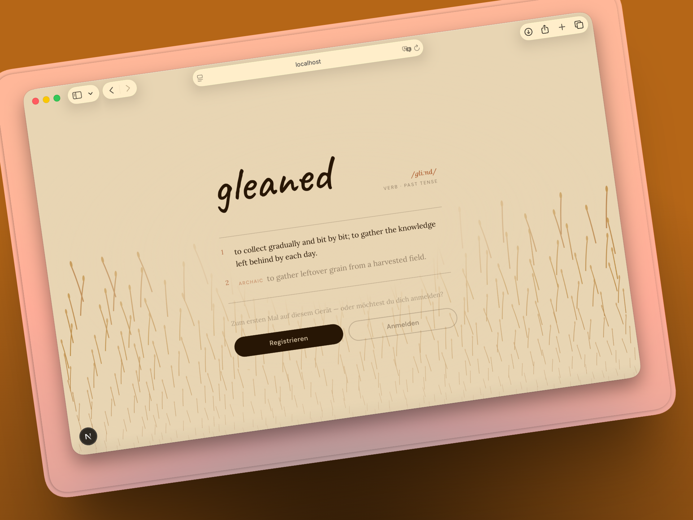
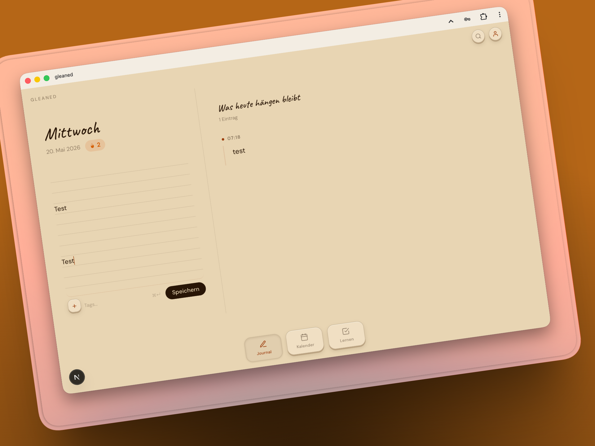
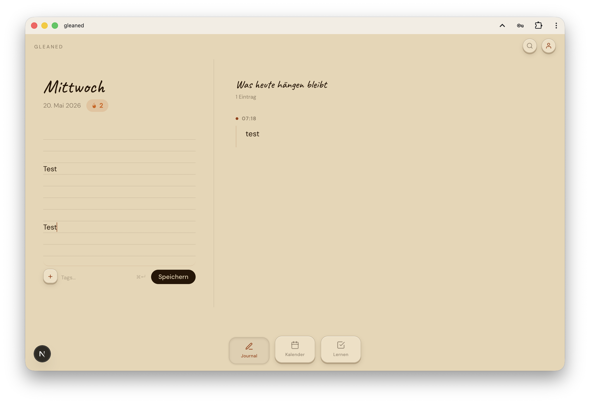
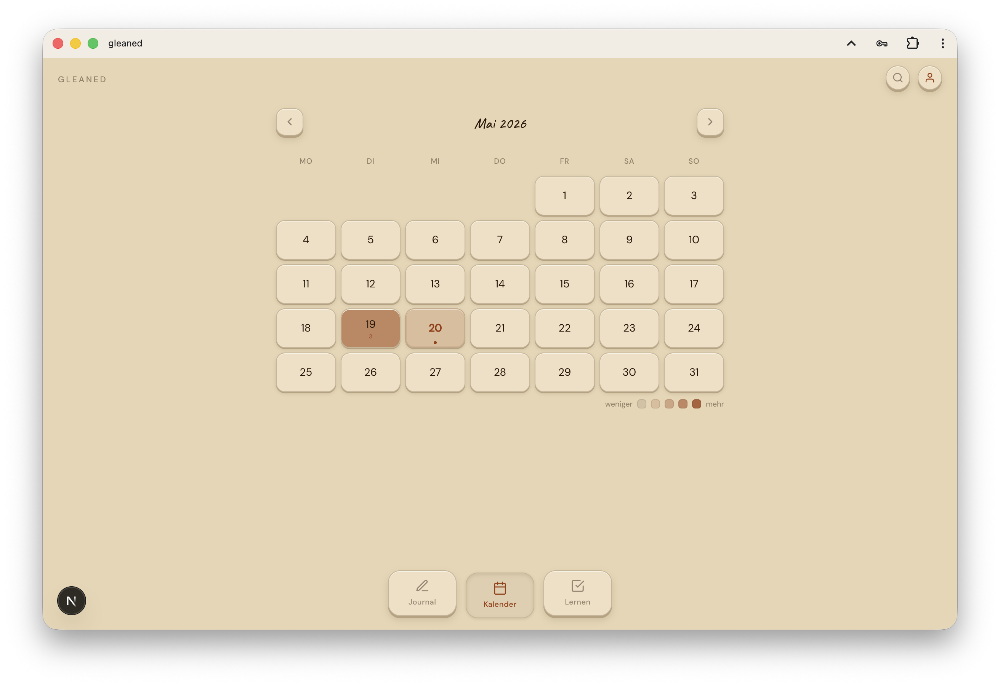
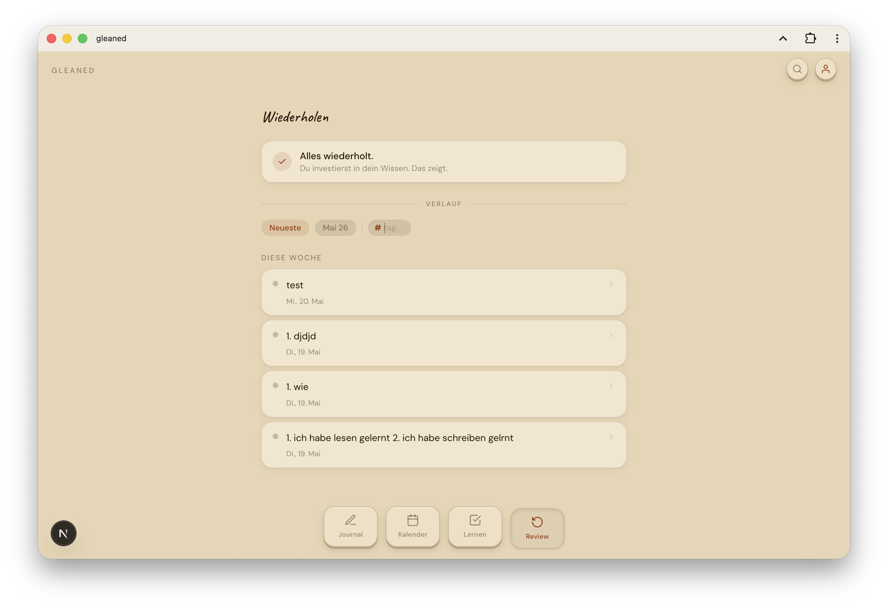
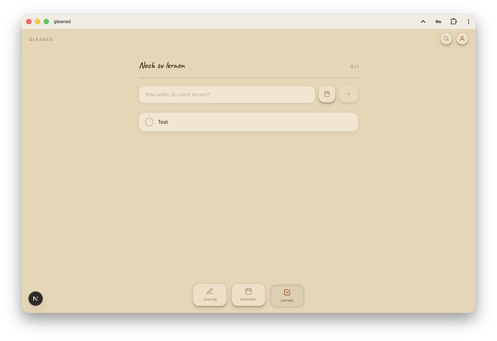
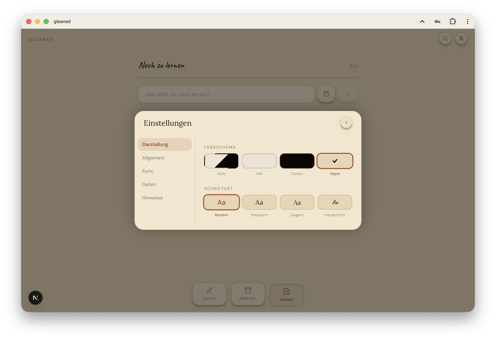

# gleaned

> *to collect gradually and bit by bit; to gather the knowledge left behind by each day.*

A personal, offline-first learning journal. Encrypted. Self-hosted. No accounts.

---

<p align="center">
  
  
</p>

---

## Why

You know those end-of-day countdown apps — the ones that tell you how many minutes until you can leave work or school. They exist to help you wait. That's the wrong direction.

gleaned starts from the opposite idea: what if, instead of watching the clock, you tracked what you actually picked up today? Not a productivity system. Not a task manager. Just a quiet place to note what stuck — a Wikipedia rabbit hole, a line of code that finally clicked, something a colleague said that made you think, an idea that arrived on the commute home.

The belief behind it is simple: every day you learn something. Most of it evaporates because nothing caught it. gleaned is the net.

It works for small things too — a single sentence, a word you looked up, a thought you don't want to lose. The bar is intentionally low. The point is the habit of noticing, not the size of the insight.

---

## Features

- **Journal** — write entries in Markdown, attach images, audio, video, code files, and PDFs
- **Spaced repetition** — every entry enters a review queue; intervals grow automatically so you revisit things right before you forget them
- **Search** — instant full-text search across all entries (⌘K / Ctrl+K)
- **Calendar** — browse any day's entries in a heatmap view
- **Learning list** — todos with due dates, color labels, and overdue indicators
- **End-to-end encryption** — PBKDF2 + AES-GCM; the key never leaves your device
- **CouchDB sync** — optional self-hosted sync across browsers and devices
- **PWA** — installable, works fully offline
- **Themes** — Auto / Light / Dark / Sepia, all in OKLCH
- **Fonts** — Modern (DM Sans) / Classic (Lora) / Elegant (Playfair Display) / Handwriting (Caveat)
- **i18n** — German and English, switchable at runtime

<details>
<summary>All views</summary>
<br>

<p align="center">
  
  
</p>
<p align="center">
  
  
</p>
<p align="center">
  
</p>

</details>

---

## Keyboard shortcuts

| Shortcut | Action |
|---|---|
| ⌘K / Ctrl+K | Open search |
| ⌘L / Ctrl+L | Lock the app |
| ⌘↵ / Ctrl+↵ | Save entry |
| Esc | Close any modal |

---

## Getting started

```bash
pnpm install
pnpm dev
# → http://localhost:3000
```

On first launch you'll be asked to set a password. This password encrypts all your entries — it cannot be recovered if lost.

---

## CouchDB sync (optional)

Sync lets you share your journal across browsers and devices. Each browser has its own local PouchDB; CouchDB merges them so all your devices see the same entries.

**Development** — run only CouchDB locally, Next.js on the host:

```bash
docker compose -f docker/compose.dev.yml up -d
pnpm dev
```

**Production (port-based):**

```bash
cp docker/.env.example .env
# edit .env — set COUCHDB_USER, COUCHDB_PASSWORD at minimum
docker compose -f docker/compose.yml up -d
# → http://localhost:3000
```

**Production (Traefik + TLS):**

```bash
cp docker/.env.example .env
# edit .env — set DOMAIN, TRAEFIK_NETWORK, COUCHDB_USER, COUCHDB_PASSWORD
docker compose -f docker/compose.traefik.yml up -d
```

Then open **Settings → Sync**. The URL is always your domain with `/db/gleaned` — the app proxies CouchDB through nginx so CouchDB is never exposed directly:

```
https://gleaned.example.com/db/gleaned
```

The Settings page shows a clickable hint with the correct URL for your current deployment. Enter your CouchDB username and password in the separate fields.

For local development with `docker/compose.dev.yml`, use the direct CouchDB port instead:

```
http://localhost:5984/gleaned
```

### Adding a second device

On a device that has no local account yet, tap **Connect device** on the welcome screen. Enter the sync URL and CouchDB credentials — the app pulls your settings (including the encryption salt) from CouchDB, then asks for your app password. No re-registration needed.

If a device already has a local account with the wrong encryption key, use the **Connect device** link at the bottom of the login screen. Export your data first (Settings → Export) if you have local entries that have not yet synced.

---

## Stack

| Layer | Technology |
|---|---|
| Framework | Next.js 16 (static export, Turbopack) |
| UI | React 19, Tailwind CSS v4 |
| Local database | PouchDB (IndexedDB) |
| Sync | CouchDB (Docker, optional) |
| Encryption | PBKDF2 + AES-GCM |
| Fonts | DM Sans, Lora, Playfair Display, Caveat |
| Package manager | pnpm |

---

## Security model

### What is encrypted

Everything you write is encrypted with AES-GCM-256 before it is stored in IndexedDB. The key is derived from your password using PBKDF2-HMAC-SHA-256 (600 000 iterations, 128-bit random salt). The key never leaves your device and is never written to storage — it lives only in JS memory for the duration of the session.

Encrypted fields per entry: content, tags, source, stake, gap, attachment binaries, attachment metadata. The `context` (learning location) field is intentionally stored unencrypted — see the metadata tradeoff section below.
Encrypted fields per thread: text.
The CouchDB password (if configured) is also stored encrypted.

### What is not encrypted — metadata tradeoff

The following fields are stored **in plaintext** in IndexedDB to allow scheduling and filtering without decryption:

| Field | Why unencrypted |
|---|---|
| `date`, `createdAt` | Required for calendar view and entry ordering |
| `entryType` | Used to select the correct review prompt |
| `context` | Learning location (Arbeit, Schule, …); stored plain for filtering |
| `gapStatus` | Drives gap-aware queue prioritisation |
| `nextReview`, `reviewInterval` | Scheduling without full DB scan |
| `stability`, `difficulty` | FSRS-5 parameters; needed for interval calculation without decryption |
| `lastReviewOutcome`, `reviewHistory` | Calibration score computation |

**Implication:** someone with access to your IndexedDB (e.g. another user on the same device, a malicious browser extension) can see *when* you made entries and how they are classified (Insight, Observation, etc.) — without knowing your password. The actual content, tags, and personal context fields remain encrypted.

If this is a concern, do not share the device or browser profile.

### Threat model

- **Remote / network attackers** — no attack surface; the app is local-only and there is no server.
- **CouchDB sync** — data is encrypted before it leaves the browser. The CouchDB server stores only ciphertext.
- **Same-origin JS (extensions, XSS)** — the AES key is in the JS heap and is accessible to any same-origin script for the duration of the session. Lock the app (⌘L) when stepping away.
- **Physical access to an unlocked device** — not protected; the key is live in memory. Lock before stepping away.
- **Physical access to a locked device** — protected; the key is wiped from memory on lock, and a wrong password cannot decrypt the data.
- **Brute force** — PBKDF2 at 600 000 iterations makes each attempt slow (~600 ms on a modern CPU). The UI adds exponential backoff (1 s, 2 s, 4 s … 30 s cap) persisted across page reloads.
